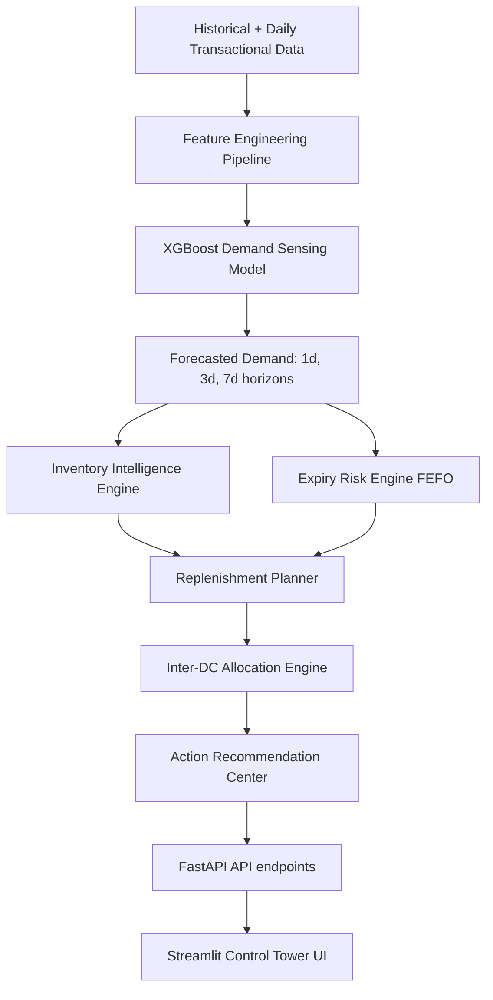

# MedCare AI Supply Chain Control Tower

MedCare AI Supply Chain Control Tower is a production-grade, end-to-end pharmaceutical demand sensing, forecasting, and replenishment optimization platform. 

It is designed to solve two core logistics challenges for MedCare Pharma:
1. **Stock-outs**: Preventing critical medicine shortages caused by sudden regional demand spikes, promotional activities, and seasonality.
2. **Expiry-driven wastage**: Identifying near-expiry batches across Distribution Centers (DCs) and utilizing a dynamic First-Expiry, First-Out (FEFO) rebalancing engine to recommend inter-DC transfers instead of writing off stock.

---

## 1. System Architecture

The application follows the core architectural principle: **one primary ML forecasting model** for near-term demand sensing, combined with **deterministic business rules** for safety stock boundaries, ROP limits, expiry risks, supplier replenishment, and inter-DC rebalancing.



---

## 2. Technology Stack

* **Language**: Python 3.11+
* **Backend Framework**: FastAPI, Pydantic, Uvicorn
* **Database Layer**: SQLAlchemy (fully supports SQLite by default, MySQL configurable via environment variables)
* **Forecasting (ML)**: XGBoost, Scikit-learn, Pandas, NumPy, Joblib
* **Data Visualization**: Plotly
* **Frontend Dashboard**: Streamlit (customized with Outfit typography and premium CSS styles)
* **Testing**: Pytest

---

## 3. Supply Chain Optimization Rules

* **Days of Inventory ($DOI$)**: 
  $$DOI = \frac{\text{Available Inventory}}{\text{Average Daily Forecasted Demand}}$$
* **Safety Stock ($SS$)**:
  $$SS = Z \times \sigma_{\text{demand}} \times \sqrt{\text{Lead Time}}$$
  *(Configurable service levels: 90%, 95%, 99%)*
* **Reorder Point ($ROP$)**:
  $$ROP = (\text{Average Daily Forecasted Demand} \times \text{Lead Time}) + SS$$
* **Replenishment Quantity**:
  $$\text{Recommended Order} = \max(0, \text{Target Stock} - \text{Available Stock} - \text{In-Transit Stock})$$
  *(Rounded up to SKU MOQ and capped by DC storage capacity limits)*
* **FEFO Expiry simulation**: Simulates daily inventory consumption sorted by expiration dates to project wastage. Stock is flagged as at-risk only when remaining batch quantity exceeds the projected demand during its remaining shelf life.

---

## 4. Quick Start (One-Command Setup)

The application includes a `run.py` script that automatically verifies assets, generates synthetic data, trains the machine learning models, sets up the database schema, seeds the database, and boots up both the FastAPI backend and Streamlit dashboard.

### Prerequisites
Make sure Python 3.11+ is installed.

### Step 1: Install Dependencies
```bash
pip install -r requirements.txt
```

### Step 2: Launch Control Tower
Simply run:
```bash
python run.py
```

This will:
1. Verify directories and create `.env` config file.
2. Generate ~57,000 transaction rows of synthetic pharmaceutical data if missing.
3. Train 1-day, 3-day, and 7-day XGBoost demand forecasting models (chronological split).
4. Build the SQLite schema and seed the database.
5. Launch the **FastAPI Backend API** at `http://localhost:8000`.
6. Launch the **Streamlit Dashboard Control Tower** at `http://localhost:8501`.

---

## 5. API Documentation

Once the server is running, the interactive Swagger API documentation is available at:
* **Swagger UI**: [http://localhost:8000/api/docs](http://localhost:8000/api/docs)
* **Redoc**: [http://localhost:8000/api/redoc](http://localhost:8000/api/redoc)

---

## 6. Predefined Demo Scenarios

The Control Tower dashboard features a **"CHOOSE SCENARIO"** selector in the sidebar to simulate critical supply chain events in real-time:

1. **Scenario 1: Regional Demand Spike**: Pre-triggers a sudden 45% demand spike for a critical medicine (`MED003`) at `Bangalore DC`. Shows safety stock breach and critical stock-out alerts.
2. **Scenario 2: Near-Expiry Transfer (Rebalancing)**: Chennai DC has excess inventory of `MED001` expiring in 25 days, while Bangalore DC has a shortage. System flags Chennai's expiry risk, notices Bangalore's shortage, and recommends an immediate inter-DC transfer.
3. **Scenario 3: Cross-DC Shortage Resolution**: Demonstrates joint rebalancing. System matches Bangalore's large shortage to Chennai's excess, recommends a transfer, and automatically triggers a secondary supplier purchase order for the remaining shortfall.
4. **Scenario 4: Stable Inventory**: Resets `MED008` across all distribution centers to healthy stock levels, validating that the engine resolves alerts and recommends `NO_ACTION`.
5. **Scenario 5: Critical Medicine Shortage**: Emergency category medicine `MED015` hits a low stock level. The system escalates the risk to `CRITICAL` instantly, triggering immediate escalation reviews.

---

## 7. Running Tests

To run the automated test suite, use pytest:
```bash
pytest tests/
```
